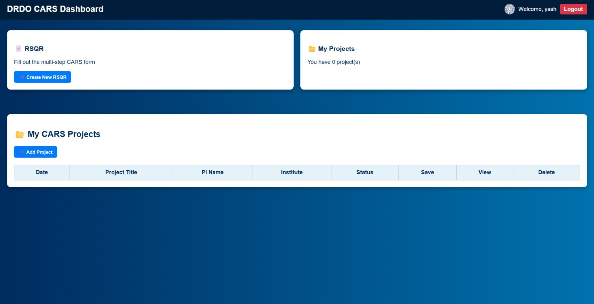
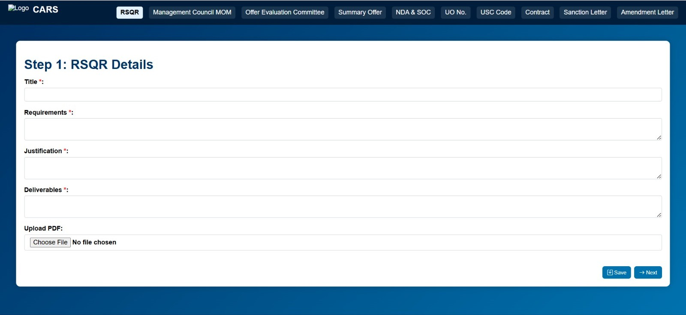
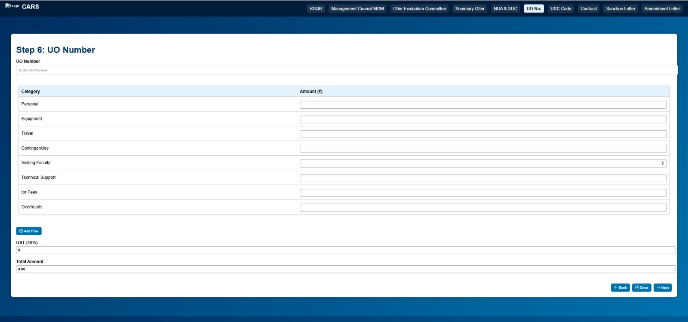

# CARS — Contract for Acquisition of Research Services

A web application built during my internship at **DRDO** to digitize and manage the end-to-end lifecycle of research service acquisition contracts. Instead of maintaining scattered paper files, CARS lets users go through a **step-by-step, multi-stage online form** (mirroring the official 10-stage contract process) and store all related details, documents, and timelines in one place.

---

## 📌 About the Project

At DRDO, acquiring research services involves a formal contract process that goes through **10 distinct stages** — from initiation to final closure — each requiring specific documents, approvals, and details to be recorded.

CARS replicates this real-world workflow as a **wizard-style web form**: just like filling an online form step by step, the user progresses through each of the 10 stages of the contract, entering the relevant details, uploading/tracking associated papers, and maintaining a timeline of the entire process — all stored digitally instead of on paper.

### Key Features
- 🧩 **10-stage step-by-step workflow** — mirrors the actual contract acquisition process stage by stage
- 📄 **Document & paper tracking** — store details of all papers/documents associated with each stage
- 🕒 **Timeline tracking** — maintain a clear record of when each stage was completed
- 💾 **Centralized storage** — no more scattered physical files; everything in one system
- 🔎 **Easy retrieval** — quickly look up a contract's current stage, history, and associated documents

---

## 🛠️ Tech Stack

- **Backend:** Python (Flask)
- **Frontend:** HTML, CSS, Jinja2 templates (`templates/`), static assets (`static/`)
- **Forms:** Flask-WTF (`forms.py`)
- **Database Models:** `models/`
- **Routing:** `routes/`
- **Configuration:** `config.py`
- **Deployment:** `Procfile` (Heroku-style deployment)
- **Dependencies:** listed in `requirements.txt`

---

## 📁 Project Structure

```
app/
├── models/         # Database models
├── routes/         # Application routes/blueprints
├── static/         # CSS, JS, images
├── templates/      # HTML (Jinja2) templates
├── utils/          # Helper/utility functions
├── __init__.py     # App factory / initialization
├── config.py       # App configuration
├── forms.py        # Flask-WTF form definitions
.gitignore
Procfile
requirements.txt
run.py              # Entry point to run the app
```

---

## ⚙️ Installation & Setup

1. **Clone the repository**
   ```bash
   git clone <your-repo-url>
   cd CARS--Project
   ```

2. **Create a virtual environment**
   ```bash
   python -m venv venv
   source venv/bin/activate      # On Windows: venv\Scripts\activate
   ```

3. **Install dependencies**
   ```bash
   pip install -r requirements.txt
   ```

4. **Configure environment**
   - Update `config.py` with your required settings (database URI, secret key, etc.)

5. **Run the application**
   ```bash
   python run.py
   ```

6. Open your browser and go to `http://127.0.0.1:5000/`

---

## 🚀 Usage

1. Start a new contract entry through the first stage of the form.
2. Fill in the required details for that stage and proceed to the next.
3. Continue through all 10 stages, entering associated documents/paper details and timeline info as you go.
4. Once completed, view the full record — including stage-wise history and documents — anytime.

---

## 🎯 Motivation

This project was built to solve a real problem observed during my DRDO internship: contract-related paperwork was maintained manually, making it hard to track the current stage, locate documents, or review the timeline of a contract. CARS was my attempt to bring that process online in a simple, guided, form-based way.

---

## 📷 Screenshots

### Dashbaord


###  RSQR


###  UO number



## 🙏 Acknowledgements

Built during my internship at **DRDO (Defence Research and Development Organisation)**.

---

## 📄 License

This project was developed for internal/internship purposes. 
